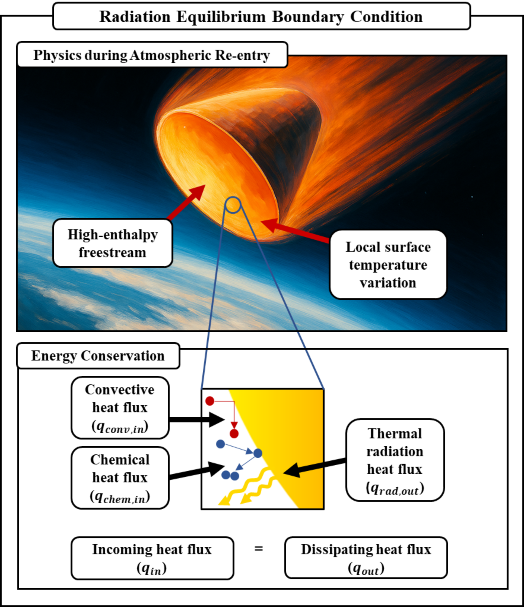
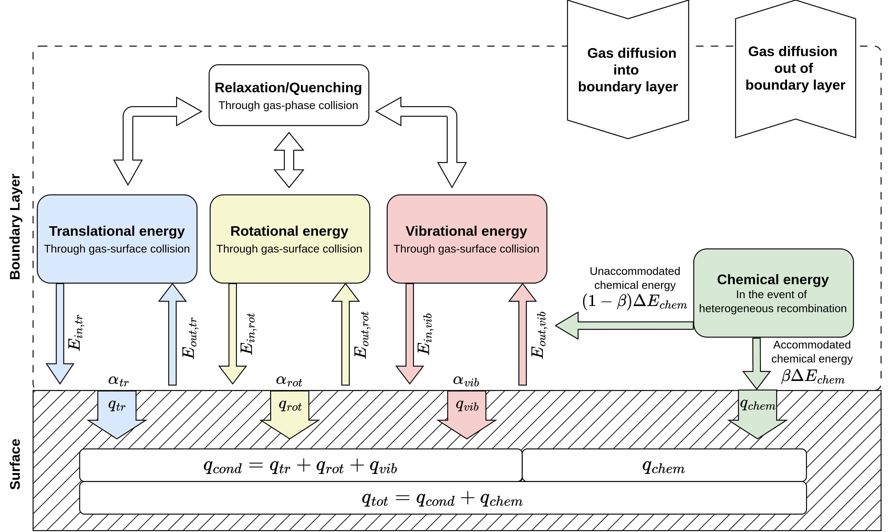
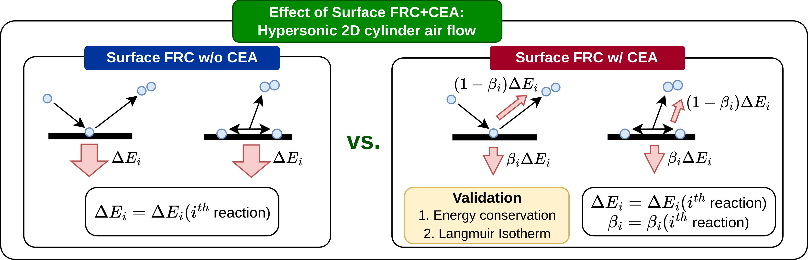
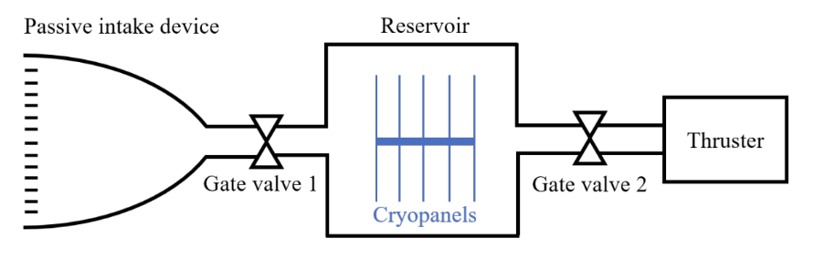
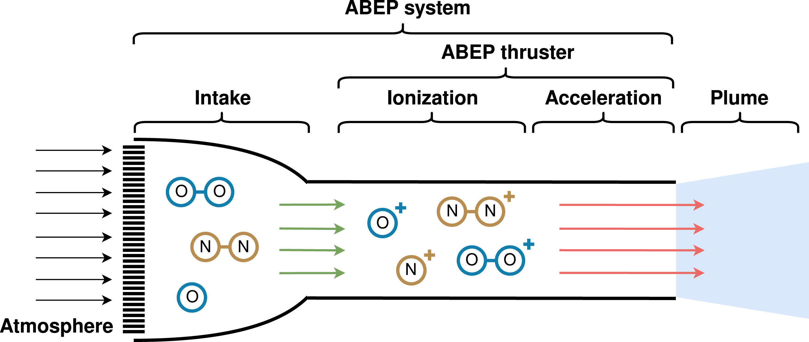

<h2>Journal</h2>

    

            
    

    

        <a id="blue-bg" class="pub-title" href="https://arxiv.org/abs/2504.15842">Radiative equilibrium boundary condition and correlation analysis on catalytic surfaces in DSMC</a>  
        <b class="pub-me">Youngil Ko</b>, <a class="collaborator" href="https://scholar.google.com/citations?user=YDnD0o8AAAAJ&hl=en&oi=ao">Eunji Jun</a>  
         International Journal of Heat and Mass Transfer [Under Review] 
    

    

        <a id="blue-bg" class="pub-title" href="https://arxiv.org/abs/2503.02021">Operational Feasibility Analysis of a Cryogenic Active Intake Device for Atmosphere-Breathing Electric Propulsion</a>  
        <a class="collaborator" href="https://scholar.google.com/citations?user=2Q0odFEAAAAJ&hl=en&oi=ao">Geonwoong Moon</a>, <b class="pub-me">Youngil Ko</b>, Minwoo Yi, <a class="collaborator" href="https://scholar.google.com/citations?user=YDnD0o8AAAAJ&hl=en&oi=ao">Eunji Jun</a>  
         Aerospace Science and Technology [Under Review] 
    

    

            
    

    

        <a id="blue-bg" class="pub-title" href="https://doi.org/10.1063/5.0222518">Mechanism-specific chemical energy accommodation with finite-rate surface chemistry in non-equilibrium flow</a>  
        <b class="pub-me">Youngil Ko</b>, <a class="collaborator" href="https://scholar.google.com/citations?user=YDnD0o8AAAAJ&hl=en&oi=ao">Eunji Jun</a>  
         Physics of Fluids 36, no.9 (2024): 096115 
    

    

            
    

    

        <a id="blue-bg" class="pub-title" href="https://doi.org/10.1016/j.actaastro.2023.07.043">Parametric study on the flight envelope of a radio-frequency ion thruster based atmosphere-breathing electric propulsion system</a>  
        <b class="pub-me">Youngil Ko</b>, Sangwon Kim, <a class="collaborator" href="https://scholar.google.com/citations?user=2Q0odFEAAAAJ&hl=en&oi=ao">Geonwoong Moon</a>, Minwoo Yi, Kangmin Park, Younho Kim, <a class="collaborator" href="https://scholar.google.com/citations?user=YDnD0o8AAAAJ&hl=en&oi=ao">Eunji Jun</a>  
         Acta Astronautica 212 (2023): 198-212 
    

<h2>Conference</h2>

    

        <a id="blue-bg" class="pub-title" href="https://drive.google.com/file/d/1KgkpswmItraiTXAfle-gTAIj2AGlZaOI/view">Validation of Air-Carbon Ablation Model of Carbon-based Ablation TPS using DSMC</a>   Suyeon Ma, <b class="pub-me">Youngil Ko</b>, <a class="collaborator" href="https://scholar.google.com/citations?user=YDnD0o8AAAAJ&hl=en&oi=ao">Eunji Jun</a>  
        The Korean Society for Aeronautical & Space Sciences KSAS (Jeju, Republic of Korea, Apr 2025) 
    

    

        <a id="blue-bg" class="pub-title" href="https://drive.google.com/file/d/16nMqZxJsNbHc7M8vQ0Udd_Yw9HlllLdj/view">Re-entry Flow Analysis Considering Surface Reaction and Radiation Equilibrium</a>  
        <b class="pub-me">Youngil Ko</b>, <a class="collaborator" href="https://scholar.google.com/citations?user=YDnD0o8AAAAJ&hl=en&oi=ao">Eunji Jun</a>  
        The Korean Society for Aeronautical & Space Sciences KSAS (Jeju, Republic of Korea, Apr 2025) 
    

    

        <a id="blue-bg" class="pub-title" href="https://drive.google.com/file/d/1771oCDEi2zhDovRoQP2N7E7ZVzIccPeZ/view">Numerical Analysis of the Operational Concept of a Cryogenic Active Intake Device for Atmosphere-Breathing Electric Propulsion</a>  
        <a class="collaborator" href="https://scholar.google.com/citations?user=2Q0odFEAAAAJ&hl=en&oi=ao">Geonwoong Moon</a>, <b class="pub-me">Youngil Ko</b>, <a class="collaborator" href="https://scholar.google.com/citations?user=YDnD0o8AAAAJ&hl=en&oi=ao">Eunji Jun</a>  
        The Korean Society of Propulsion Engineers KSPE (Busan, Republic of Korea, Nov 2024) 
    

    

            
    

    

        <a id="blue-bg" class="pub-title" href="https://drive.google.com/file/d/1jEPNHO32P2kKjFRkTzep_CwI5aHh5e1I/view">Reaction mechanism-specific chemical energy accommodation in Direct Simulation Monte Carlo</a>  
        <b class="pub-me">Youngil Ko</b>, <a class="collaborator" href="https://scholar.google.com/citations?user=YDnD0o8AAAAJ&hl=en&oi=ao">Eunji Jun</a>  
        33rd International Symposium on Rarefied Gas Dynamics (Göttingen, Germany, Jul 2024) 
    

    

            
    

    

        <a id="blue-bg" class="pub-title" href="https://drive.google.com/file/d/1ZKwb3Wjf64XzPGrWQ6tiSDgRFFUpKygz/view">Feasibility Analysis of a Cryogenic Active Intake Device for Atmosphere-Breathing Electric Propulsion</a>  
        <a class="collaborator" href="https://scholar.google.com/citations?user=2Q0odFEAAAAJ&hl=en&oi=ao">Geonwoong Moon</a>, <b class="pub-me">Youngil Ko</b>, <a class="collaborator" href="https://scholar.google.com/citations?user=YDnD0o8AAAAJ&hl=en&oi=ao">Eunji Jun</a>  
        33rd International Symposium on Rarefied Gas Dynamics (Göttingen, Germany, Jul 2024) 
    

    

        <a id="blue-bg" class="pub-title" href="https://drive.google.com/file/d/15nOzrCSKlPD0lqTYVGwnDoXWq9h2gea_/view">Surface Reaction Chemical Energy Accommodation Model for Re-entry Flows</a>  
        <b class="pub-me">Youngil Ko</b>, <a class="collaborator" href="https://scholar.google.com/citations?user=YDnD0o8AAAAJ&hl=en&oi=ao">Eunji Jun</a>  
        The Korean Society for Aeronautical & Space Sciences KSAS (Changwon, Republic of Korea, Jun 2024) 
    

    

            
    

    

        <a id="blue-bg" class="pub-title" href="https://drive.google.com/file/d/1UETzeO1E-pleC8hUkGm9YfVvkFIua7ci/view?usp=drive_link">Surface Catalytic Effect on Chemical Heat Flux using Direct Simulation Monte Carlo</a>  
        <b class="pub-me">Youngil Ko</b>, <a class="collaborator" href="https://scholar.google.com/citations?user=YDnD0o8AAAAJ&hl=en&oi=ao">Eunji Jun</a>  
        The 3rd International Conference on High-Speed Vehicle Science and Technology (Busan, Republic of Korea, Apr 2024) 
    

    

        <a id="blue-bg" class="pub-title" href="https://drive.google.com/file/d/1zdSj-06rI9eXchffRc4_c-HalyfeAHZy/view">Conceptual system analysis of atmosphere-breathing electric propulsion for very-low-Earth-orbit operation</a>  
        <a class="collaborator" href="https://scholar.google.com/citations?user=2Q0odFEAAAAJ&hl=en&oi=ao">Geonwoong Moon</a>, <b class="pub-me">Youngil Ko</b>, Sangwon Kim, Minwoo Yi, Younho Kim, <a class="collaborator" href="https://scholar.google.com/citations?user=YDnD0o8AAAAJ&hl=en&oi=ao">Eunji Jun</a>  
        The Korean Society for Aeronautical & Space Sciences KSAS (Yeosu, Republic of Korea, Jun 2023) 
    

    

            
    

    

        <a id="blue-bg" class="pub-title" href="https://drive.google.com/file/d/1dcTrSRodEYliaUBQuzmWqq9kVE6K1zoe/view">Conceptual System Analysis of Very-Low-Earth-Orbit Satellites with Atmosphere-Breathing Electric Propulsion</a>  
        <a class="collaborator" href="https://scholar.google.com/citations?user=YDnD0o8AAAAJ&hl=en&oi=ao">Eunji Jun</a>, <a class="collaborator" href="https://scholar.google.com/citations?user=2Q0odFEAAAAJ&hl=en&oi=ao">Geonwoong Moon</a>, <b class="pub-me">Youngil Ko</b>, Sangwon Kim  
        The 11th Asian Joint Conference on Propulsion and Power AJCPP (Kanazawa, Japan, Mar 2023) 
    

    

        <a id="blue-bg" class="pub-title" href="https://drive.google.com/file/d/1sWOzsGBudn0xxMG9frTFUY7DXt5MCeaf/view">Flight Envelope Determination of Atmosphere-Breathing Electric Propulsion System</a>  
        <b class="pub-me">Youngil Ko</b>, Sangwon Kim, <a class="collaborator" href="https://scholar.google.com/citations?user=2Q0odFEAAAAJ&hl=en&oi=ao">Geonwoong Moon</a>, <a class="collaborator" href="https://scholar.google.com/citations?user=YDnD0o8AAAAJ&hl=en&oi=ao">Eunji Jun</a> 
        The Korean Society of Propulsion Engineers KSPE (Jeju, Republic of Korea, Mar 2023) 
    

    

        <a id="blue-bg" class="pub-title" href="https://drive.google.com/file/d/1n_MhPnNev-CmyQMu5qBY8IuGJmg0P2mw/view">Drag Compensation Feasibility of an Atmosphere-Breathing Electric Propulsion System</a>  
        <b class="pub-me">Youngil Ko</b>, Sangwon Kim, <a class="collaborator" href="https://scholar.google.com/citations?user=2Q0odFEAAAAJ&hl=en&oi=ao">Geonwoong Moon</a>, <a class="collaborator" href="https://scholar.google.com/citations?user=YDnD0o8AAAAJ&hl=en&oi=ao">Eunji Jun</a> 
        The Korean Society of Propulsion Engineers KSPE (Busan, Republic of Korea, Nov 2022) 
    

