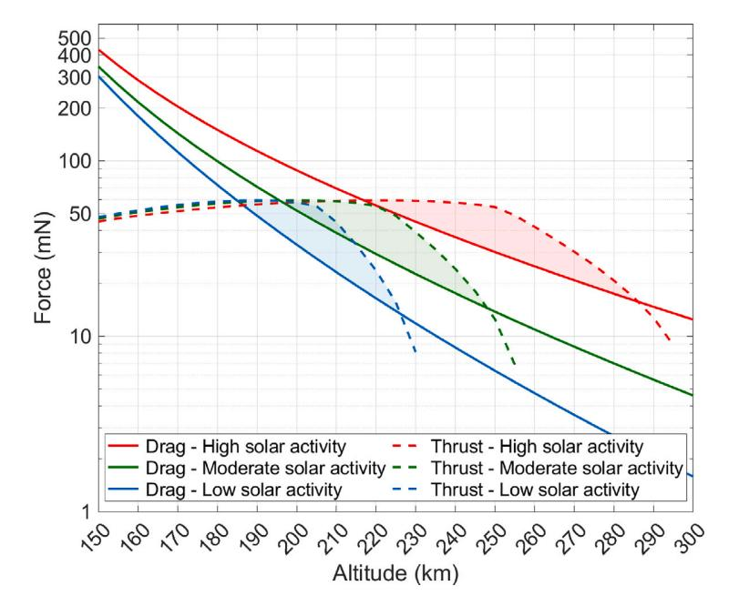
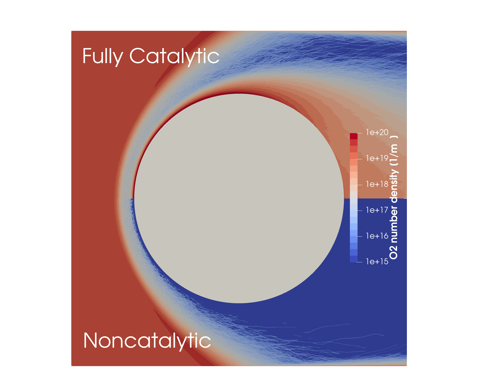

<h2>Journal</h2>

Moon, G., <b>Ko, Y.</b>, Yi, M., & Jun, E. (n.d.). <i><a href="https://arxiv.org/abs/2503.02021">Operational feasibility analysis of a cryogenic active intake device for atmosphere-breathing electric propulsion</a></i>. Manuscript submitted for publication.

<b>Ko, Y.</b>, & Jun, E. (2026). <a href="https://doi.org/10.1016/j.ijheatmasstransfer.2025.127693">Radiative equilibrium boundary condition and correlation analysis on catalytic surfaces in DSMC</a>. <i>International Journal of Heat and Mass Transfer</i>, <i>255</i>, 127693.

<b>Ko, Y.</b>, & Jun, E. (2024). <a href="https://doi.org/10.1063/5.0222518">Mechanism-specific chemical energy accommodation with finite-rate surface chemistry in non-equilibrium flow</a>. <i>Physics of Fluids</i>, <i>36</i>(9), 096115.

<b>Ko, Y.</b>, Kim, S., Moon, G., Yi, M., Park, K., Kim, Y., & Jun, E. (2023). <a href="https://doi.org/10.1016/j.actaastro.2023.07.043">Parametric study on the flight envelope of a radio-frequency ion thruster based atmosphere-breathing electric propulsion system</a>. <i>Acta Astronautica</i>, <i>212</i>, 198–212.

<h2>Conference</h2>

<b>Ko, Y.</b>, Moon, G., & Jun, E. (2025, June). <i>Effect of surface recombination reaction on performance of intake device</i> The Korean Society for Aeronautical & Space Sciences (KSAS) Conference, Yeosu, Korea.

Park, W., <b>Ko, Y.</b>, & Jun, E. (2025, April). <i><a href="https://drive.google.com/file/d/1Ajfi1D7RvN-DWJH9th9MHx-pQXM6rixS/view">Advanced gas-surface interaction model considering atomic oxygen in very low Earth orbit</a></i> Korean Society for Computational Fluids Engineering (KSCFE) Conference, Iksan, Korea.

Ma, S., <b>Ko, Y.</b>, & Jun, E. (2025, April). <i><a href="https://drive.google.com/file/d/1KgkpswmItraiTXAfle-gTAIj2AGlZaOI/view">Validation of air-carbon ablation model of carbon-based ablation TPS using DSMC</a></i> The Korean Society for Aeronautical & Space Sciences (KSAS) Conference, Jeju, Korea.

<b>Ko, Y.</b>, & Jun, E. (2025, April). <i><a href="https://drive.google.com/file/d/16nMqZxJsNbHc7M8vQ0Udd_Yw9HlllLdj/view">Re-entry flow analysis considering surface reaction and radiation equilibrium</a></i> The Korean Society for Aeronautical & Space Sciences (KSAS) Conference, Jeju, Korea.

Moon, G., <b>Ko, Y.</b>, & Jun, E. (2024, November). <i><a href="https://drive.google.com/file/d/1771oCDEi2zhDovRoQP2N7E7ZVzIccPeZ/view">Numerical analysis of the operational concept of a cryogenic active intake device for atmosphere-breathing electric propulsion</a></i> The Korean Society of Propulsion Engineers (KSPE) Conference, Busan, Korea.

<b>Ko, Y.</b>, & Jun, E. (2024, July). <i><a href="https://drive.google.com/file/d/1jEPNHO32P2kKjFRkTzep_CwI5aHh5e1I/view">Reaction mechanism-specific chemical energy accommodation in Direct Simulation Monte Carlo</a></i> 33rd International Symposium on Rarefied Gas Dynamics (RGD33), Göttingen, Germany.

Moon, G., <b>Ko, Y.</b>, & Jun, E. (2024, July). <i><a href="https://drive.google.com/file/d/1ZKwb3Wjf64XzPGrWQ6tiSDgRFFUpKygz/view">Feasibility analysis of a cryogenic active intake device for atmosphere-breathing electric propulsion</a></i> 33rd International Symposium on Rarefied Gas Dynamics (RGD33), Göttingen, Germany.

<b>Ko, Y.</b>, & Jun, E. (2024, June). <i><a href="https://drive.google.com/file/d/15nOzrCSKlPD0lqTYVGwnDoXWq9h2gea_/view">Surface reaction chemical energy accommodation model for re-entry flows</a></i> The Korean Society for Aeronautical & Space Sciences (KSAS) Conference, Changwon, Korea.

<b>Ko, Y.</b>, & Jun, E. (2024, April). <i><a href="https://drive.google.com/file/d/1UETzeO1E-pleC8hUkGm9YfVvkFIua7ci/view?usp=drive_link">Surface catalytic effect on chemical heat flux using Direct Simulation Monte Carlo</a></i> The 3rd International Conference on High-Speed Vehicle Science and Technology (HiSST), Busan, Korea.

Moon, G., <b>Ko, Y.</b>, Kim, S., Yi, M., Kim, Y., & Jun, E. (2023, June). <i><a href="https://drive.google.com/file/d/1zdSj-06rI9eXchffRc4_c-HalyfeAHZy/view">Conceptual system analysis of atmosphere-breathing electric propulsion for very-low-Earth-orbit operation</a></i> The Korean Society for Aeronautical & Space Sciences (KSAS) Conference, Yeosu, Korea.

Jun, E., Moon, G., <b>Ko, Y.</b>, & Kim, S. (2023, March). <i><a href="https://drive.google.com/file/d/1dcTrSRodEYliaUBQuzmWqq9kVE6K1zoe/view">Conceptual system analysis of very-low-Earth-orbit satellites with atmosphere-breathing electric propulsion</a></i> The 11th Asian Joint Conference on Propulsion and Power (AJCPP), Kanazawa, Japan.

<b>Ko, Y.</b>, Kim, S., Moon, G., & Jun, E. (2023, March). <i><a href="https://drive.google.com/file/d/1sWOzsGBudn0xxMG9frTFUY7DXt5MCeaf/view">Flight envelope determination of atmosphere-breathing electric propulsion system</a></i> The Korean Society of Propulsion Engineers (KSPE) Conference, Jeju, Korea.

<b>Ko, Y.</b>, Kim, S., Moon, G., & Jun, E. (2022, November). <i><a href="https://drive.google.com/file/d/1n_MhPnNev-CmyQMu5qBY8IuGJmg0P2mw/view">Drag compensation feasibility of an atmosphere-breathing electric propulsion system</a></i> The Korean Society of Propulsion Engineers (KSPE) Conference, Busan, Korea.

